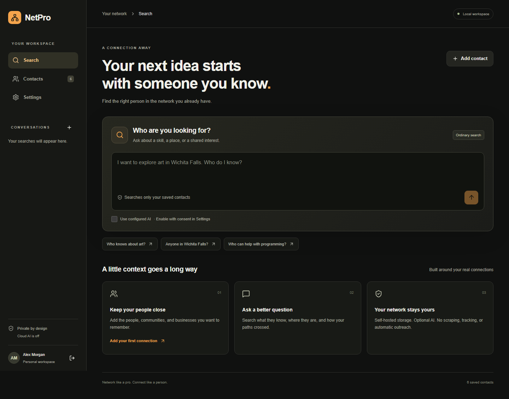
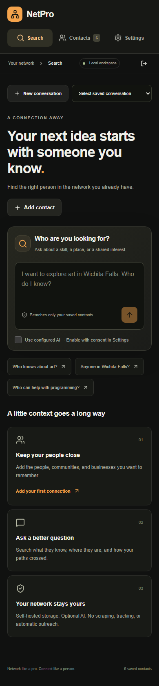

# NetPro — Network Like a Pro

Your network, remembered. A private, open-source, self-hosted app for one owner to save people, organizations, businesses and online connections, then find the right person for a need.

Ask “Who knows about art?” and follow with “Anyone in Wichita Falls?” NetPro returns recorded details, direct/tentative matches, contact methods and full profiles. Ordinary search works offline. Optional AI selects validated evidence from a small local shortlist; it cannot invent result details.




## Run locally

Requires Node.js 24 LTS. In this repository:

```sh
npm ci
cp .env.example .env.local
node -e "console.log(require('crypto').randomBytes(32).toString('hex'))"
```

On PowerShell, use `Copy-Item .env.example .env.local`. Set the generated value as `NETPRO_ENCRYPTION_KEY` in `.env.local`, then:

```sh
npm run build
npm start
```

Open **http://localhost:3000**, create your owner account and add contacts. AI is off until you configure a provider and explicitly consent. For development: `npm run dev`. Database migrations run automatically; SQLite data is in `data/` and stays outside Git. Docker: configure `.env`, then `docker compose up --build -d`.

## Included

- Single-owner setup, scrypt passwords, protected sessions, origin checks and persistent login limits.
- Structured contact management, full profiles, multiple validated methods, favorites, directory filters and duplicate warnings.
- Ordinary network retrieval, saved conversations, contextual follow-ups and deletion.
- Optional OpenAI/Gemini/compatible provider settings, encrypted keys, consent/revocation, connection test and safe fallback.
- Versioned private JSON export/import, validated preview, explicit replacement and pre-replacement recovery backup.
- Responsive dark interface, keyboard focus, reduced motion and resettable synthetic demo seed.

No automatic outreach, scraping, external enrichment, web search, relationship scores, public registration or PWA features.

## Guides

[Installation & account recovery](docs/installation.md) · [Docker](docs/docker.md) · [AI configuration & current model notes](docs/ai.md) · [Backup & restore](docs/backup.md) · [Architecture](docs/architecture.md) · [Privacy](docs/privacy.md) · [Future Vercel/PostgreSQL migration](docs/vercel-postgres.md)

[Release notes](RELEASE_NOTES.md) · [Contributing](CONTRIBUTING.md) · [Security](SECURITY.md) · [MIT license](LICENSE)

The interface takes inspiration from the hierarchy, dark surfaces and accent restraint of [Outcrowd's Investment Dashboard](https://dribbble.com/shots/26847991-Investment-Dashboard). It uses original layouts and assets, with no financial charts or invented relationship metrics.

## Verification

```sh
npm test
npm run lint
npm run typecheck
npm run build
npx playwright install chromium
npm run test:browser
```

AI tests use a local mock server and synthetic fixtures. Real provider connectivity requires the owner's own API key and is not claimed by mocked checks. Docker execution and GitHub publication depend on available local tooling/credentials; see release notes for actual verification status.
